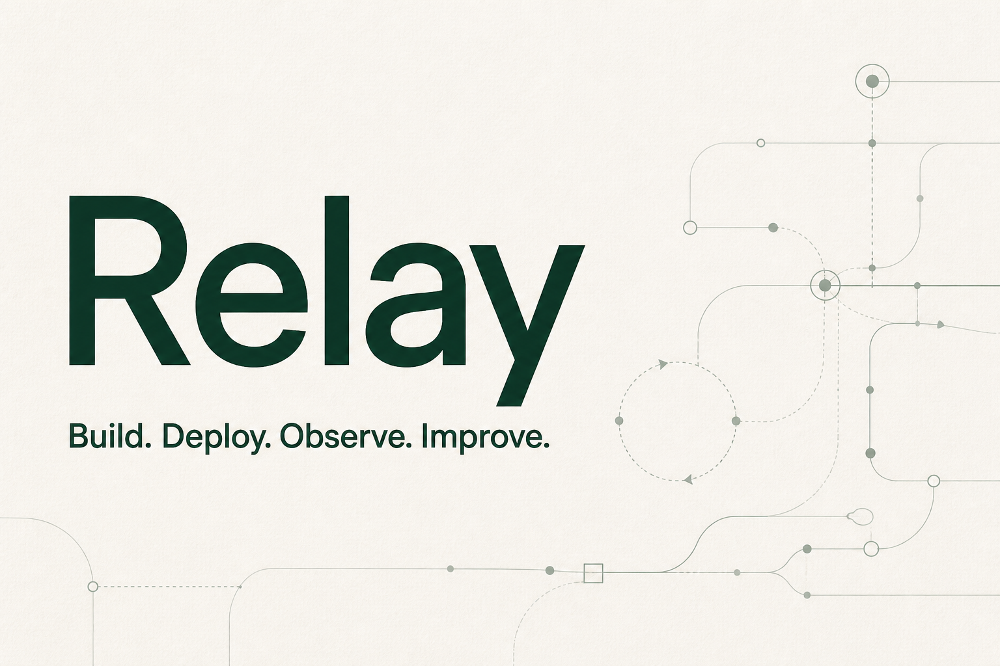

# Relay — Agent Operations

Relay is a compact, production-shaped control plane for building and operating AI agents. It gives a solo founder one place to configure agents, connect tools, execute workflows, inspect traces, approve risky actions, and run regression evaluations.

[](https://relay-agent-operations.abc123xyza.chatgpt.site)
[](https://www.typescriptlang.org/)
[](https://developers.cloudflare.com/d1/)

> The hosted demo is private and uses ChatGPT identity. Clone the repository to run the complete platform locally without credentials.



## What Relay includes

- **Agent Studio** — configure prompts, providers, models, temperature, lifecycle state, tool allowlists, and guardrails.
- **Agent runtime** — run a deterministic local model or the OpenAI Responses API with multi-turn function calling.
- **Tool registry** — use built-in tools or register public HTTPS endpoints with GET/POST behavior.
- **Approval gates** — pause state-changing tool calls and let an operator approve or reject the captured arguments.
- **Observability** — retain runs, ordered model/tool/guardrail steps, latency, token counts, estimated cost, and errors.
- **Evaluations** — create persistent suites, execute regression cases, and view release-readiness scores.
- **Governance** — workspace roles, prompt-injection checks, PII redaction, and attributed audit records.
- **Durable storage** — Cloudflare D1 with a Drizzle schema, generated migrations, and idempotent seed data.
- **Deployable application** — React 19, Vinext, Tailwind CSS, Cloudflare Workers, and OpenAI Sites.

## Product tour

| View | Purpose |
| --- | --- |
| Overview | Operational metrics, recent activity, and the release-readiness score |
| Agents | Create and inspect agent configurations and tool permissions |
| Runs | Execute agents and inspect step-by-step traces |
| Tools | Review built-ins and register public HTTPS integrations |
| Evaluations | Build regression suites and run deterministic graders |
| Guardrails | Review pending approvals and accept or reject mutating actions |

## Architecture

```text
Browser / operator
        |
        v
React control plane + API routes
        |
        +--> authorization + audit log
        +--> input guardrails
        +--> model provider (mock or OpenAI Responses API)
        +--> allowlisted tool registry
        |       +--> built-in tools
        |       +--> public HTTPS tools
        +--> approval gate for writes
        +--> output PII redaction
        |
        v
Cloudflare D1: agents, tools, runs, traces, approvals, evals, audit logs
```

The mock provider is intentionally deterministic, so the full product and evaluation loop work without an API key. The OpenAI provider uses function tools, returns outputs by tool-call ID, disables provider-side response storage, and limits a run to four model turns.

For deeper design notes, see [Architecture](docs/architecture.md). For a deployment-focused checklist, see [Deployment guide](docs/deployment.md).

## Quick start

### Requirements

- Node.js **22.13 or newer**
- npm
- Git

### Install and run

```bash
git clone https://github.com/manishklach/relay-agent-platform.git
cd relay-agent-platform
npm install
npm run dev
```

Open [http://localhost:3000](http://localhost:3000). Local development automatically uses a `local-dev` owner identity and a local D1 database. No account or model key is required.

Try these flows first:

1. Open **Runs**, select the seeded customer-care agent, and ask: `Can I get a refund for order #A-1042?`
2. Inspect the account and policy lookup steps in the trace.
3. Request a refund and open **Guardrails** to approve or reject the pending write.
4. Open **Evaluations** and run the seeded release-readiness suite.

## Configure an OpenAI model

Copy the environment template:

```bash
cp .env.example .env.local
```

On PowerShell:

```powershell
Copy-Item .env.example .env.local
```

Then set:

```dotenv
OPENAI_API_KEY=your_api_key
OPENAI_BASE_URL=https://api.openai.com/v1
```

Restart the development server, create an agent with provider `openai`, and enter a model available to your account. Keep `.env.local` private; it is ignored by Git.

If `OPENAI_API_KEY` is absent, Relay safely falls back to deterministic mock execution.

## Connect an HTTP tool

Open **Tools → Connect HTTP tool** and provide:

- a stable tool name and operator-facing description;
- a public `https://` endpoint;
- `GET` or `POST` behavior;
- whether operator approval is required.

Relay blocks loopback addresses and common private-network destinations. The first release does not persist connector credentials, so use endpoints that do not require secrets or place authentication behind a purpose-built gateway. Remote MCP transport is represented in the data model but is not enabled yet.

## Database behavior

Relay expects a D1 binding named `DB`. On startup it idempotently creates the schema and inserts:

- one default workspace;
- a customer-care reference agent;
- account lookup, policy search, and refund tools;
- a three-case release-readiness evaluation suite.

The canonical schema lives in `db/schema.ts`; generated migrations live in `drizzle/`. Generate a new migration after schema changes with:

```bash
npm run db:generate
```

## Verification

Start the development server in one terminal, then run:

```bash
npm run lint
npx tsc --noEmit
npm run test:smoke
npm run build
```

The smoke test exercises database initialization, read-only tools, stored traces, prompt-injection blocking, approval creation and rejection, and the complete evaluation loop.

## Deploy with OpenAI Sites

This repository's supported production path is OpenAI Sites, which supplies the Worker runtime, D1 binding, ChatGPT authentication headers, source versioning, and private production deployment.

1. Fork or clone the repository and open it as a project in Codex.
2. Remove or replace the existing `project_id` in `.openai/hosting.json`; it identifies the original hosted demo and must not be reused for your deployment.
3. Ask Codex to create a new private Sites project for the repository and bind D1 as `DB`.
4. Run the verification commands above.
5. Add `OPENAI_API_KEY` as a server-side environment variable only if you want real model execution.
6. Ask Codex to build, save a site version, and deploy it privately.
7. Open the production URL, run the seeded evaluation, and verify an approval flow before inviting users.

The minimal hosting configuration is:

```json
{
  "project_id": "YOUR_SITES_PROJECT_ID",
  "d1": "DB",
  "r2": null
}
```

Do not commit model keys, connector secrets, repository credentials, or deployment tokens. See the [full deployment guide](docs/deployment.md) for preflight, rollout, smoke-check, and rollback instructions.

## Authentication and roles

Hosted deployments read ChatGPT identity headers supplied by Sites. The first authenticated member becomes the workspace owner; later new members default to viewer.

| Role | Intended access |
| --- | --- |
| Owner | Full workspace control |
| Builder | Create and update agents, tools, and evaluation suites |
| Operator | Execute operational decisions such as approvals |
| Viewer | Read workspace state and traces |

For a non-Sites deployment, replace the Sites identity adapter in `app/chatgpt-auth.ts` with your authentication provider before exposing the application publicly.

## API

| Endpoint | Methods | Purpose |
| --- | --- | --- |
| `/api/overview` | GET | Dashboard metrics and recent state |
| `/api/agents` | GET, POST | List and create agents |
| `/api/tools` | GET, POST | List and register tools |
| `/api/runs` | GET, POST | List and execute runs |
| `/api/approvals` | GET, POST | List and decide approvals |
| `/api/evaluations` | GET, POST | List and create suites |
| `/api/evaluations/run` | POST | Execute an evaluation suite |

## Security notes

- Agent tools are deny-by-default through per-agent allowlists.
- State-changing calls can require an operator decision before execution.
- HTTP connectors require public HTTPS targets and reject common private destinations.
- Prompt-injection patterns are blocked before model execution.
- Email addresses and phone numbers can be redacted from final output.
- Provider-side response storage is disabled for OpenAI calls.
- Secrets stay in runtime environment variables and are not written to D1 or sent to the browser.

Before handling sensitive or regulated data, add managed connector secrets, stricter SSRF protection with DNS/IP validation, rate limiting, retention controls, model and tool timeouts, and organization-specific authorization policies.

## Project structure

```text
app/                    Pages, ChatGPT auth adapter, and API routes
components/             Control-plane UI and reusable components
db/                     D1 access, schema, and idempotent bootstrap
docs/                   Architecture and deployment documentation
drizzle/                Generated SQL migrations
lib/                    Runtime, tools, guardrails, and server helpers
public/                 Static assets and social preview
scripts/smoke.mjs       End-to-end smoke test
.openai/hosting.json    Sites project and binding declaration
vite.config.ts          Vinext, Sites, Tailwind, and Cloudflare setup
```

## Current scope

Relay is an end-to-end MVP rather than a hosted multi-tenant commercial service. The first release deliberately uses one visible workspace, deterministic contains/not-contains evaluation graders, public HTTP connectors without stored credentials, and no remote MCP transport. These boundaries keep the system understandable and deployable by one person while preserving clear extension points.

## Release

The initial public release is `v0.1.0`. See [GitHub Releases](https://github.com/manishklach/relay-agent-platform/releases) for versioned notes.
